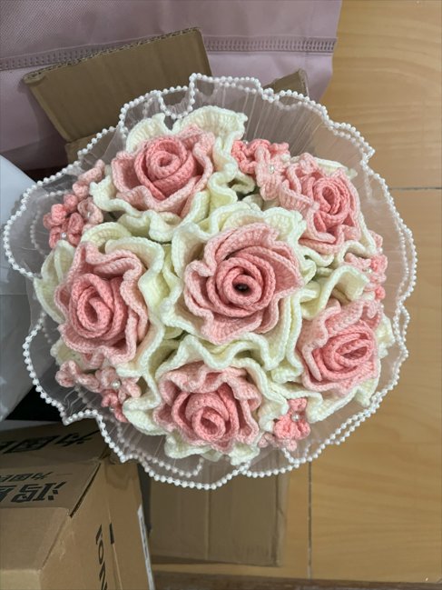

不知不觉已经结婚快3个月了，我既没有在公众号上分享，也没有在朋友圈宣传，就在8.8发了结婚证的封面，搞得有的朋友居然认为我是闹着玩。

其实，我更倾向于在公众号上记录，这和我的老婆很像，她也不喜欢发朋友圈，每次发都要屏蔽一大堆人，太麻烦了，还不如不发。这次，我将以第一人称来记录这场婚礼，和以往不同的是，这次我是主角，而前几次我都是作为旁观者。（避免出现人名，都用姓或名代替）

#### 7 月 6 日（婚礼前一周）

我做了手捧花，小陈负责一片片叶子的缝制，而我则负责将叶子粘连成花，再组合成一束。这个过程虽然繁琐，但充满了仪式感。

#### 7 月 12 日（婚礼前两天）

下午，我和姐姐/姐夫一起装饰我的房间。晚上，我还在为婚车装饰花束。海哥带我转了一大圈路线，最终确定了婚礼当天的行程。

#### 7 月 13 日（婚礼前一天）

早上，我开始制作开场视频，还找了一段吃饭时播放的《蜡笔小新》剧场版。下午，我装饰了小陈的房间，张带我又熟悉了婚礼路线。我和胡一起去试了现场的音响和屏幕。晚饭后，我们开始扎婚车，并确定了接亲车队的顺序。半夜，我接待了远道而来的朋友，我们一起吃了烤鲫鱼、炒豆子、烤藕片、卤鸭头，这些也算是当地的特色美食了。

#### 7 月 14 日（婚礼当天）

凌晨，我和两个外甥一起聊天、睡觉。早上四点多，我被摄影师的电话叫醒，开始准备拍摄。胡说不用带太多东西，只要准备好红包就行，真是让人哭笑不得。

本来我们准备了三个门：一楼的铁闸门、二楼的大门和接亲房间的门。结果一楼的铁闸门因为去得太快，没来得及堵门；二楼大门在给舅妈红包后就开了；接亲房间门有姐姐做内应，根本没堵就开了！于是，我们开始玩套圈游戏，其实就是给红包，然后让他们拿小饼干、核桃、酥饼、汉堡等。第一轮一个都没中，第二轮我叫他们帮忙，小妍太厉害了，第一个就中了，但舅妈耍赖，只给了一只鞋。接着叫敬民，他也是一下就中了，真是上辈子修来的福气。

接下来是穿鞋和表白环节。第一次小陈居然不满意，说只要钱，这么浪漫的场合，她还和我谈钱！于是我又按照要求重新说了一遍，然后穿鞋、敬茶，和父母拥抱，最后拍了全家福。

因为修路，我们提前准备了糖、烟、红包给胡，让他在路口守着，防止逆行。顺利接上车后，我们顺利回家。回到家后，没有走什么复杂的流程，只是敬了个茶就上房间了，不过杰哥写的流程贴在墙上，很有仪式感。

奇怪的是，居然没有小孩来要红包。两个外甥为了游戏皮肤来了好多次，本来就是准备给他们的。小外甥女不来，还是我硬给的，看来长大反而害羞了。

搞笑的是，我在台上说了几句话，全是错别字。上台前思绪万千，不知道该说什么，也没啥特别想对他们说的。因为结婚是我们两个家庭的事情，准确地说，是我们两个人的事情。

剩下的就是吃饭了，没啥特别值得说的。很尴尬的是，彬哥来晚了，我居然随口说没位置，太尴尬了。过年一定要给他补上，然后再当面道个歉。

到此记录完毕，礼成！我结婚了！

#### 8月 8日（领证）

去武昌区民政局登记结婚

如果想看婚礼成片识别下方二维码即可查看

